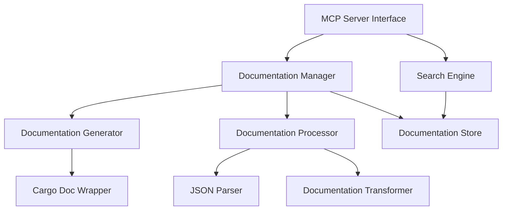

# Design Document: Rust Documentation Search MCP Server

## Overview

The Rust Documentation Search MCP Server is designed to make Rust documentation more accessible to AI agents and developers by generating, processing, and providing efficient search capabilities for Rust crate documentation. The server uses `cargo doc` to build documentation and implements fuzzy searching to extract relevant information in a format optimized for LLM consumption.

This design document outlines the architecture, components, interfaces, data models, error handling, and testing strategy for the MCP server implementation.

## Architecture

The system follows a modular architecture with clear separation of concerns:



### Key Components

1. **MCP Server Interface**: Handles communication with the Kiro IDE through the MCP protocol, exposing tools for documentation search and retrieval.

2. **Documentation Manager**: Orchestrates the generation, processing, and storage of documentation.

3. **Search Engine**: Implements fuzzy search capabilities to find relevant documentation based on queries.

4. **Documentation Generator**: Manages the process of generating documentation using `cargo doc`.

5. **Documentation Processor**: Transforms raw documentation into LLM-friendly formats.

6. **Documentation Store**: Provides efficient storage and retrieval of processed documentation.

## Components and Interfaces

### 1. MCP Server Interface

The MCP Server Interface exposes the following tools:

#### Tool: `search_rust_docs`

```python
{
    "name": "search_rust_docs",
    "description": "Search Rust documentation using fuzzy matching",
    "parameters": {
        "type": "object",
        "properties": {
            "query": {
                "type": "string",
                "description": "The search query (function name, type, trait, etc.)"
            },
            "crate": {
                "type": "string",
                "description": "Optional crate name to limit search scope"
            },
            "max_results": {
                "type": "integer",
                "description": "Maximum number of results to return",
                "default": 5
            },
            "include_std": {
                "type": "boolean",
                "description": "Whether to include standard library in search",
                "default": true
            }
        },
        "required": ["query"]
    }
}
```

#### Tool: `get_rust_doc_details`

```python
{
    "name": "get_rust_doc_details",
    "description": "Get detailed documentation for a specific Rust item",
    "parameters": {
        "type": "object",
        "properties": {
            "item_path": {
                "type": "string",
                "description": "Full path to the item (e.g., 'std::vec::Vec::push')"
            },
            "include_examples": {
                "type": "boolean",
                "description": "Whether to include code examples",
                "default": true
            },
            "include_methods": {
                "type": "boolean",
                "description": "Whether to include methods (for types)",
                "default": true
            }
        },
        "required": ["item_path"]
    }
}
```

#### Tool: `generate_crate_docs`

```python
{
    "name": "generate_crate_docs",
    "description": "Generate and process documentation for a specific crate",
    "parameters": {
        "type": "object",
        "properties": {
            "crate_path": {
                "type": "string",
                "description": "Path to the crate directory"
            },
            "include_dependencies": {
                "type": "boolean",
                "description": "Whether to include dependencies",
                "default": true
            }
        },
        "required": ["crate_path"]
    }
}
```

### 2. Documentation Manager

The Documentation Manager coordinates the generation, processing, and storage of documentation:

```python
class DocumentationManager:
    def __init__(self, config):
        self.config = config
        self.doc_generator = DocumentationGenerator(config)
        self.doc_processor = DocumentationProcessor(config)
        self.doc_store = DocumentationStore(config)
        
    async def generate_and_process_docs(self, crate_path, include_dependencies=True):
        """Generate and process documentation for a crate and optionally its dependencies."""
        
    async def get_documentation(self, item_path, include_examples=True, include_methods=True):
        """Retrieve documentation for a specific item."""
        
    async def refresh_documentation(self, crate_path):
        """Refresh documentation for a crate that may have been updated."""
```

### 3. Search Engine

The Search Engine implements fuzzy search capabilities:

```python
class SearchEngine:
    def __init__(self, doc_store, config):
        self.doc_store = doc_store
        self.config = config
        
    async def search(self, query, crate=None, max_results=5, include_std=True):
        """Search documentation using fuzzy matching."""
        
    def _calculate_relevance(self, item, query):
        """Calculate relevance score for an item based on the query."""
        
    def _format_search_results(self, results):
        """Format search results for LLM consumption."""
```

### 4. Documentation Generator

The Documentation Generator manages the process of generating documentation using `cargo doc`:

```python
class DocumentationGenerator:
    def __init__(self, config):
        self.config = config
        self.cargo_wrapper = CargoDocWrapper()
        
    async def generate_docs(self, crate_path, include_dependencies=True):
        """Generate documentation for a crate using cargo doc."""
        
    async def get_doc_path(self, crate_path):
        """Get the path where documentation is generated."""
```

### 5. Documentation Processor

The Documentation Processor transforms raw documentation into LLM-friendly formats:

```python
class DocumentationProcessor:
    def __init__(self, config):
        self.config = config
        self.json_parser = JsonParser()
        self.transformer = DocumentationTransformer()
        
    async def process_docs(self, doc_path):
        """Process raw documentation into LLM-friendly format."""
        
    def _extract_essential_info(self, raw_doc):
        """Extract essential information from raw documentation."""
        
    def _simplify_structure(self, doc_structure):
        """Simplify complex nested structures."""
```

### 6. Documentation Store

The Documentation Store provides efficient storage and retrieval of processed documentation:

```python
class DocumentationStore:
    def __init__(self, config):
        self.config = config
        self.db_path = config.get("db_path", "./rust_docs_db")
        self._initialize_db()
        
    def _initialize_db(self):
        """Initialize the documentation database."""
        
    async def store_documentation(self, crate_name, version, processed_docs):
        """Store processed documentation in the database."""
        
    async def get_documentation(self, item_path):
        """Retrieve documentation for a specific item."""
        
    async def search(self, query, crate=None, include_std=True):
        """Search documentation based on a query."""
        
    async def clear_cache(self, older_than=None):
        """Clear cached documentation, optionally based on age."""
```

## Data Models

### 1. Processed Documentation Item

```python
class DocItem:
    """Represents a processed documentation item."""
    
    def __init__(self):
        self.path = ""  # Full path to the item (e.g., 'std::vec::Vec::push')
        self.name = ""  # Name of the item
        self.kind = ""  # Kind of item (function, struct, trait, etc.)
        self.signature = ""  # Signature (for functions, methods)
        self.description = ""  # Description/documentation
        self.parameters = []  # List of parameters (for functions)
        self.return_type = ""  # Return type (for functions)
        self.examples = []  # Code examples
        self.notes = []  # Important notes or warnings
        self.related_items = []  # Related items
        self.crate = ""  # Crate name
        self.version = ""  # Crate version
        self.methods = []  # Methods (for types)
        self.fields = []  # Fields (for structs)
        self.trait_implementations = []  # Trait implementations (for types)
```

### 2. Search Result

```python
class SearchResult:
    """Represents a search result."""
    
    def __init__(self):
        self.item_path = ""  # Path to the item
        self.name = ""  # Name of the item
        self.kind = ""  # Kind of item
        self.snippet = ""  # Short snippet/description
        self.relevance_score = 0.0  # Relevance score
        self.crate = ""  # Crate name
        self.version = ""  # Crate version
```

### 3. Configuration

```python
class Config:
    """Configuration for the MCP server."""
    
    def __init__(self, config_dict=None):
        self.db_path = "./rust_docs_db"  # Path to the documentation database
        self.cache_size_limit = 1024 * 1024 * 1024  # 1 GB cache size limit
        self.cache_ttl = 7 * 24 * 60 * 60  # 7 days cache TTL
        self.default_crates = ["std"]  # Default crates to include
        self.max_search_results = 10  # Maximum search results
        self.fuzzy_match_threshold = 0.7  # Fuzzy match threshold
        
        if config_dict:
            self.__dict__.update(config_dict)
```

## Error Handling

The system implements a comprehensive error handling strategy:

### 1. Error Types

```python
class RustDocError(Exception):
    """Base class for all Rust documentation errors."""
    pass

class DocGenerationError(RustDocError):
    """Error during documentation generation."""
    pass

class DocProcessingError(RustDocError):
    """Error during documentation processing."""
    pass

class SearchError(RustDocError):
    """Error during documentation search."""
    pass

class StorageError(RustDocError):
    """Error during documentation storage or retrieval."""
    pass

class ConfigurationError(RustDocError):
    """Error in configuration."""
    pass
```

### 2. Error Handling Strategy

- All functions that can fail will return structured error responses
- Errors will include:
  - Error type
  - Error message
  - Suggested resolution (when applicable)
  - Context information
- The MCP interface will translate internal errors to MCP-compliant error responses
- Detailed error logging will be implemented for debugging

### 3. Example Error Handling

```python
async def generate_and_process_docs(self, crate_path, include_dependencies=True):
    """Generate and process documentation for a crate and optionally its dependencies."""
    try:
        # Generate documentation
        doc_path = await self.doc_generator.generate_docs(crate_path, include_dependencies)
        
        # Process documentation
        processed_docs = await self.doc_processor.process_docs(doc_path)
        
        # Store documentation
        await self.doc_store.store_documentation(
            crate_name=self._extract_crate_name(crate_path),
            version=self._extract_crate_version(crate_path),
            processed_docs=processed_docs
        )
        
        return {
            "status": "success",
            "message": f"Documentation generated and processed for {crate_path}",
            "doc_count": len(processed_docs)
        }
    except DocGenerationError as e:
        logging.error(f"Documentation generation error: {str(e)}")
        return {
            "status": "error",
            "error_type": "doc_generation",
            "message": str(e),
            "suggestion": "Ensure the crate path is valid and cargo is installed"
        }
    except DocProcessingError as e:
        logging.error(f"Documentation processing error: {str(e)}")
        return {
            "status": "error",
            "error_type": "doc_processing",
            "message": str(e),
            "suggestion": "Check the generated documentation format"
        }
    except StorageError as e:
        logging.error(f"Documentation storage error: {str(e)}")
        return {
            "status": "error",
            "error_type": "storage",
            "message": str(e),
            "suggestion": "Check storage permissions and available space"
        }
    except Exception as e:
        logging.error(f"Unexpected error: {str(e)}")
        return {
            "status": "error",
            "error_type": "unexpected",
            "message": f"An unexpected error occurred: {str(e)}",
            "suggestion": "Check the logs for more details"
        }
```

## Testing Strategy

The testing strategy includes unit tests, integration tests, and end-to-end tests:

### 1. Unit Tests

- Test each component in isolation with mocked dependencies
- Focus on testing the core functionality of each component
- Use pytest for testing
- Aim for high test coverage (>80%)

Example unit test for the Search Engine:

```python
async def test_search_engine_basic_search():
    # Arrange
    mock_doc_store = MockDocumentationStore()
    mock_doc_store.add_test_data([
        {"path": "std::vec::Vec::push", "name": "push", "description": "Appends an element to the vector"},
        {"path": "std::vec::Vec::pop", "name": "pop", "description": "Removes the last element from the vector"}
    ])
    
    config = Config({"fuzzy_match_threshold": 0.7})
    search_engine = SearchEngine(mock_doc_store, config)
    
    # Act
    results = await search_engine.search("psh", crate="std")
    
    # Assert
    assert len(results) == 1
    assert results[0].item_path == "std::vec::Vec::push"
    assert results[0].relevance_score > 0.7
```

### 2. Integration Tests

- Test the interaction between components
- Focus on testing the flow of data through the system
- Use real documentation for a small test crate

Example integration test:

```python
async def test_generate_and_search_flow():
    # Arrange
    config = Config({
        "db_path": "./test_rust_docs_db",
        "fuzzy_match_threshold": 0.7
    })
    
    doc_manager = DocumentationManager(config)
    search_engine = SearchEngine(doc_manager.doc_store, config)
    
    # Act
    # Generate and process docs for a test crate
    result = await doc_manager.generate_and_process_docs("./test_crates/simple_crate")
    
    # Search for a function in the generated docs
    search_results = await search_engine.search("add_numbers", crate="simple_crate")
    
    # Assert
    assert result["status"] == "success"
    assert len(search_results) > 0
    assert search_results[0].name == "add_numbers"
```

### 3. End-to-End Tests

- Test the complete system through the MCP interface
- Verify that the tools work as expected
- Test with real-world crates

Example end-to-end test:

```python
async def test_mcp_search_tool():
    # Arrange
    server = create_test_server()
    
    # Act
    response = await server.invoke_tool("search_rust_docs", {
        "query": "Vec push",
        "include_std": True,
        "max_results": 3
    })
    
    # Assert
    assert response["status"] == "success"
    assert len(response["results"]) > 0
    assert any("push" in result["name"].lower() for result in response["results"])
```

### 4. Performance Tests

- Test the performance of the search functionality
- Measure response times for different query types
- Test with large crates to ensure scalability

Example performance test:

```python
async def test_search_performance():
    # Arrange
    config = Config()
    doc_manager = DocumentationManager(config)
    search_engine = SearchEngine(doc_manager.doc_store, config)
    
    # Generate docs for a large crate
    await doc_manager.generate_and_process_docs("./test_crates/large_crate")
    
    # Act
    start_time = time.time()
    results = await search_engine.search("common_function_name")
    end_time = time.time()
    
    # Assert
    assert end_time - start_time < 2.0  # Search should complete within 2 seconds
    assert len(results) > 0
```

## Implementation Plan

The implementation will follow these phases:

1. **Setup Phase**
   - Set up project structure
   - Configure development environment
   - Implement basic MCP server skeleton

2. **Core Components Phase**
   - Implement Documentation Generator
   - Implement Documentation Processor
   - Implement Documentation Store

3. **Search Functionality Phase**
   - Implement Search Engine
   - Integrate fuzzy search algorithms
   - Optimize search performance

4. **MCP Integration Phase**
   - Implement MCP tools
   - Handle error cases
   - Ensure proper response formatting

5. **Testing and Refinement Phase**
   - Implement unit tests
   - Implement integration tests
   - Optimize performance
   - Refine documentation processing

6. **Documentation and Deployment Phase**
   - Document the codebase
   - Create user documentation
   - Prepare for deployment